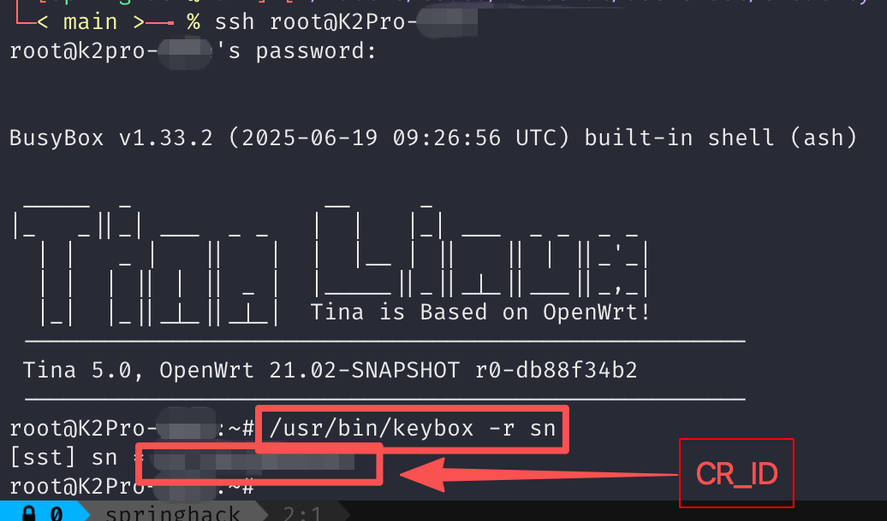
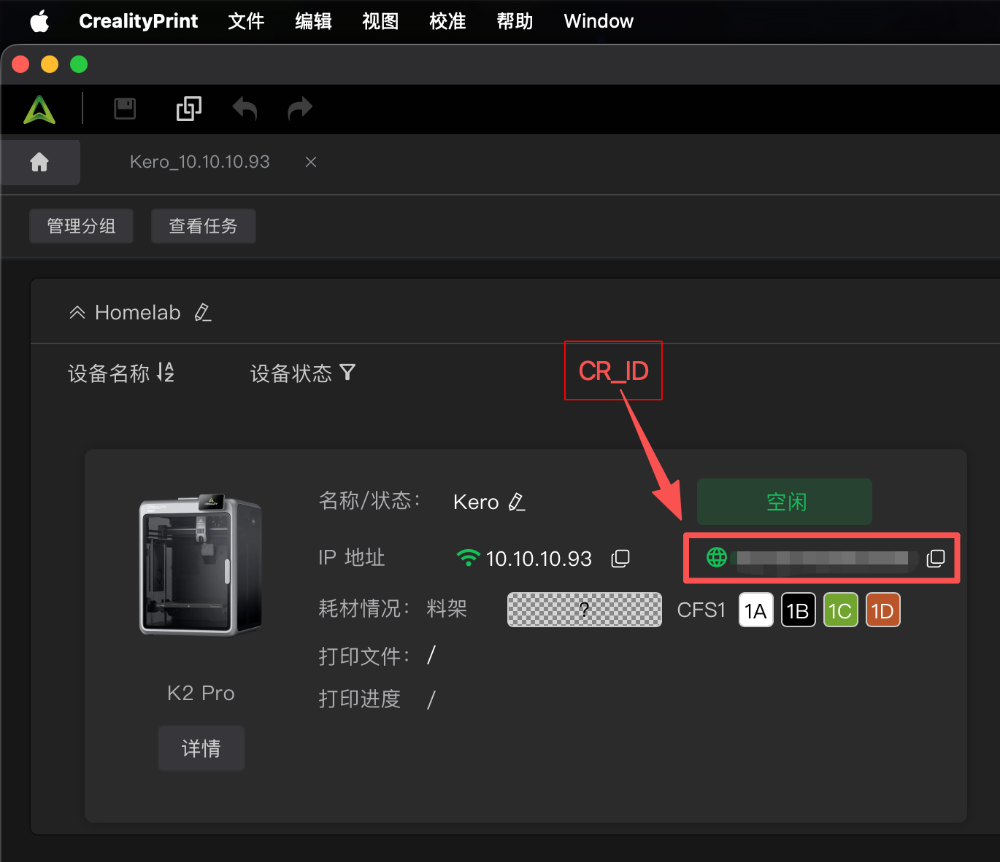

# Auto Discovery Creality Device And Forward TCP

### Config Envs
- `CR_ID`: printer id, eg: `1234567890ABCD`
- `CR_IFACE`: which network interface to scan
- `CR_PORTS`: tcp ports to forward, eg: `4408`
- `CR_INTERVAL`: how often to scan, eg: `10`
- `CR_CAMERA`: enable camera WebRTC relay on port `8000`, default: `true`

When `CR_CAMERA` is enabled, open `http://<host>:8000` to view the printer
camera. It forwards WebRTC traffic to `http://<printer-ip>:8000/call/webrtc_local`.

### Get `CR_ID`
> Servel ways, eg: mobile app info, ssh or `Creality Print` desktip client

